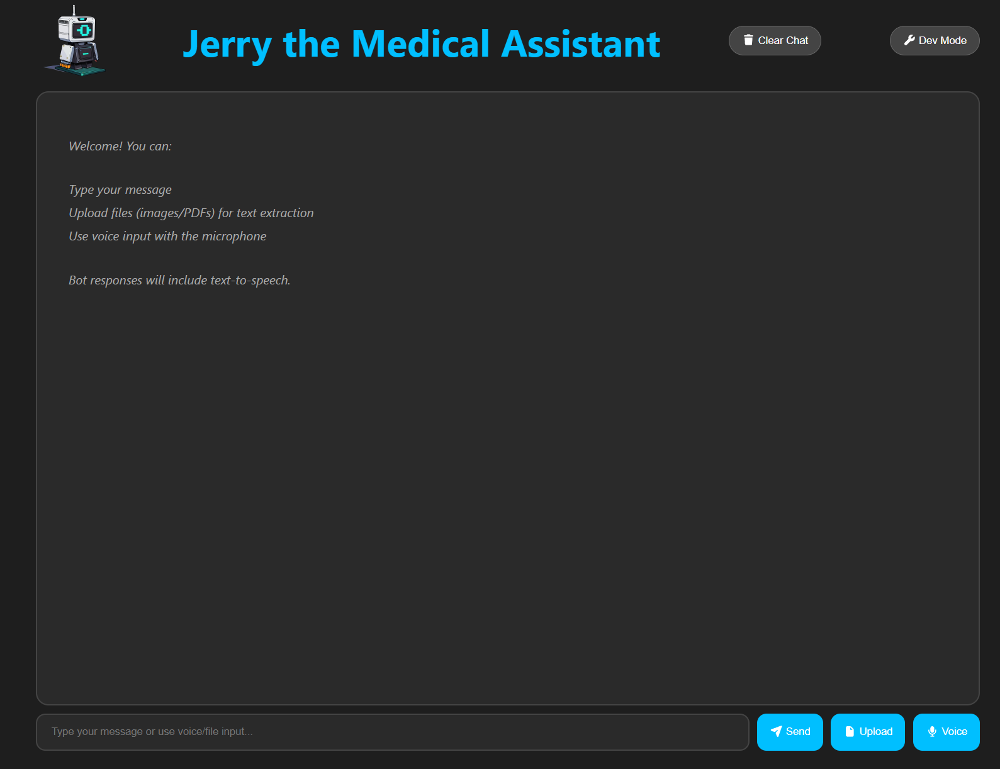

# 🏥 Jerry — AI Medical Assistant

Jerry is a fine-tuned large language model designed to act as a medical chatbot. It combines a custom-trained Qwen3-8B model with a full-stack web application, allowing users to ask medical questions and receive intelligent, context-aware responses.

**Live at:** [jerry-the-medical-assistant.vercel.app](https://jerry-the-medical-assistant.vercel.app/) (server currently inactive)   
**Demo at:** [jerry-the-medical-assistant.youtube.com](https://www.youtube.com/watch?v=Xhl7pib7z5o)

<p align="center">
  
</p>

---

## 📁 Project Structure

```
jerry-the-medical-assistant/
├── backend/        # Python server (vLLM + Ngrok tunnel)
├── frontend/       # React/TypeScript web UI (Vite)
├── model/          # Fine-tuning scripts and SARI evaluation
├── dataset/        # Dataset processing notebooks
└── README.md
```

---

## 🧩 Components

### 1. Dataset Processing

The model is trained on the [AI Medical Chatbot dataset from Kaggle](https://www.kaggle.com/datasets/yousefsaeedian/ai-medical-chatbot).

**Steps:**
1. Download the dataset from Kaggle.
2. Open `DataOutputProcessing.ipynb` in the `dataset/` folder.
3. Set up a [Hugging Face](https://huggingface.co) account and add your token to the notebook.
4. Install the required dependencies and run the notebook to preprocess the data.

---

### 2. Model Fine-Tuning

> ⚠️ **Hardware requirement: 60 GB VRAM minimum.** Google Colab Pro was used for this step.

**Steps:**
1. Reformat the processed dataset into `.parquet` format, or download the pre-formatted version:
   - 📦 [Pre-formatted dataset (Google Drive)](https://drive.google.com/drive/folders/108_8uL-6HTn1_Rf22fRdGFNzrxXGzDX2?usp=sharing)
2. Place the `.parquet` file in the same directory as `SFT.ipynb`.
3. Run `SFT.ipynb` on a device with ≥ 60 GB VRAM. The final cell saves the trained model weights.
   - Alternatively, download the pre-trained model directly:
   - 📦 [Fine-tuned model (Google Drive)](https://drive.google.com/file/d/13xoplY0-SrNULChwuSAo988l828CaEEc/view?usp=sharing)

**Evaluation (SARI metric):**
1. Place the `model/` folder, `test_sari.py`, and `Qwen3-8B-SARI.ipynb` in the same directory.
2. Run `Qwen3-8B-SARI.ipynb` — results will appear in the console output.

---

### 3. Application

> ⚠️ **Hardware requirement: 8 GB VRAM minimum.**

The app runs via **Windows Subsystem for Linux (WSL)** and uses **Ngrok** for tunneling.

#### Backend (Python / vLLM)

1. Set up a Python environment with the required dependencies.
2. Place the server script on your Linux (WSL) system.
3. Configure the model path routing in the script.
4. Convert your model weights to AWQ format using [AutoAWQ](https://github.com/casper-hansen/AutoAWQ), then update the `MODEL_PATH` constant.
   - If you skip AWQ conversion, switch `awq_marlin` to `bitsandbytes` — note this is slower and requires ≥ 12 GB VRAM.
5. Add your Ngrok credentials to a `.env` file in WSL:
   ```
   NGROK_AUTHTOKEN=your_token_here
   DEV_DOMAIN=your_dev_domain_here
   ```
6. Run the server script.

#### Frontend (React / TypeScript / Vite)

1. Ensure [Node.js](https://nodejs.org) is installed.
2. Navigate to the `frontend/` directory.
3. Install dependencies:
   ```bash
   npm ci
   ```
4. Create a `.env` file with your Ngrok dev domain:
   ```
   VITE_SFT_MODEL_ENDPOINT=https://your-dev-domain.ngrok-free.app
   ```
5. Start the development server:
   ```bash
   npm run dev
   ```

---

## 🛠️ Tech Stack

| Layer | Technology |
|-------|-----------|
| Base Model | Qwen3-8B |
| Fine-tuning | SFT (Supervised Fine-Tuning) via Hugging Face |
| Inference | vLLM + AutoAWQ (AWQ Marlin) |
| Backend | Python |
| Frontend | React, TypeScript, Vite |
| Tunneling | Ngrok |
| Platform | WSL (Windows Subsystem for Linux) |

---

## 📋 Requirements Summary

| Step | VRAM Needed |
|------|------------|
| Fine-tuning | 60 GB (Google Colab Pro recommended) |
| Running the app | 8 GB (12 GB if using bitsandbytes) |

---

## 📜 License

This project is provided for educational and research purposes. Please review dataset and model licenses before any use. Please reach out to the collaboraters if interested in using any of this codebase.
